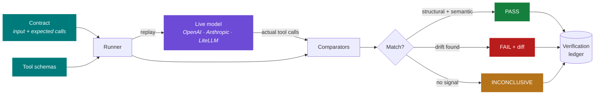
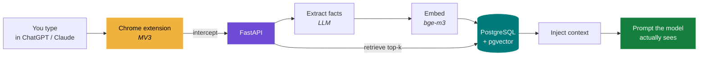

<div align="center">

<picture>
  <source media="(prefers-color-scheme: dark)" srcset="https://raw.githubusercontent.com/Divyansh2202/Divyansh2202/main/banner-dark.svg">
  <source media="(prefers-color-scheme: light)" srcset="https://raw.githubusercontent.com/Divyansh2202/Divyansh2202/main/banner-light.svg">
  
</picture>

<br/><br/>

<a href="https://divyanshrai.dev"></a>
<a href="mailto:divyanshr988@gmail.com"></a>
<a href="https://linkedin.com/in/divyanshrai01"></a>
<a href="https://divyanshrai.dev/resume"></a>

</div>

---

I take GenAI features from a notebook to production — fine-tuned LLMs and VLMs,
multi-agent orchestration, and RAG pipelines that stay fast, cheap, and
debuggable under real traffic.

**Available now** · Remote, hybrid or on-site · Open to relocating · IST, full overlap with EU and mornings with US East

---

## 🧩 toolcontract — contract testing for LLM tool-calls

<a href="https://pypi.org/project/toolcontract/"></a>
<a href="https://pypistats.org/packages/toolcontract"></a>
<a href="https://github.com/Divyansh2202/toolcontract/actions/workflows/ci.yml"></a>

**The problem.** A provider ships a new model version and your agent's
tool-calling quietly changes — an argument is invented or dropped, a different
tool gets picked for the same input, a value stops matching the schema your
downstream code depends on. Your tests still pass, because nothing in a normal
CI pipeline asserts on *which tools got called with what*. You find out in
production.

**The idea.** Pin a golden set of expected tool-call trajectories, replay them
against a live model, and get a verdict plus a diff. Pact does this for
microservice contracts; Percy does it for visual regressions. `toolcontract`
does it for tool calls.



```bash
pip install toolcontract
toolcontract run contracts/ --provider openai --model gpt-4o --tools tools.json
```

Ships with the contract model, a comparator/matching engine, a verification
ledger, OpenAI / Anthropic / LiteLLM adapters, a CLI (`run` / `accept` /
`check-version`), a pytest plugin, and an LLM-judge tier for semantic matching.

> **Honest gap:** the adapters are verified against real provider APIs for
> request-building, auth and error handling, but not yet end-to-end through a
> genuine successful tool-call response — every live attempt so far hit a
> billing wall first. Those fixtures are research-backed, not live-confirmed.

---

## 🧠 mnemos — a memory layer for AI assistants

<a href="https://github.com/Divyansh2202/mnemos"></a>
<a href="https://github.com/Divyansh2202/mnemos/stargazers"></a>
<a href="https://divyanshrai.dev/projects/mnemos"></a>

Assistants forget everything between sessions. mnemos extracts facts from
conversations, embeds them, and injects the relevant ones before each new
message — invisibly, across ChatGPT and Claude. Memories live per *user*, not
per platform, so context follows the person instead of resetting with the tool.



`FastAPI` · `PostgreSQL + pgvector` · `Ollama` · `Chrome Extension (MV3)` · `MCP`

---

## 🚀 Shipped to production

Three systems serving real users at **TapHealth** (Mar 2025 – Jul 2026).

| System | What it does | What it took |
|---|---|---|
| **Multimodal macro-nutrient pipeline** | Logs meals from speech, text or a photo | ASR + NLP + Vision over a 10K-recipe / 30K-alias store. ~2s on the DB path, 3–5s on LLM fallback, ~90% accuracy |
| **AI Coach** | Conversational health agent | Rebuilt orchestration onto a bounded tool-calling loop over 13 steps, driven by 16+ Kafka event domains |
| **Qwen3-VL-2B fine-tune** | Food recognition at the edge | 300K+ samples curated; 6GB → 1.9GB INT4 GGUF (68% smaller) with accuracy held; ≤6s on-device |

---

## 🔬 Research

| | |
|---|---|
| **AECA** | Whether an agent can learn *when* to keep a memory raw, compress it to a skill, or crystallise it into a rule — instead of one fixed compression level for everything |
| **RLVR-TTT** | Pairing test-time training with verifiable rewards, so a weight update is kept only when it measurably helps |
| **ICICES 2023** | Published, IET DAVV — data science for precision agriculture |

---

## 🛠 Stack

| | |
|---|---|
| **Machine Learning** | PyTorch · TensorFlow · Scikit-Learn · Computer Vision · NLP · large-scale training pipelines |
| **Fine-Tuning & Optimisation** | LoRA · QLoRA · SFT · Unsloth · TRL · LLaMA-Factory · Quantization (GGUF, INT4) · llama.cpp · vLLM |
| **Generative AI & LLMs** | LLM/VLM system design · RAG pipelines · Prompt Engineering · Multi-Agent & Tool-Calling Systems |
| **LLM Orchestration** | Vercel AI SDK · LangGraph · LangChain |
| **Agentic Systems & SDKs** | MCP · Gemini SDK · Ollama · Memory: HindSight, Mem0 |
| **Backend & Data Infra** | Redis · Kafka · PostgreSQL · ClickHouse |
| **Observability** | Langfuse · OpenTelemetry · distributed tracing · cost & performance optimisation |
| **Vector Databases** | pgVector · semantic search · embedding pipelines |
| **Programming** | Python (Pandas, NumPy, SciPy) · SQL · OpenCV · NLTK · Streamlit · Hugging Face Transformers |
| **Deployment & MLOps** | Docker · Git · CI/CD · Edge AI deployment · scalable inference systems |
| **Data & Analytics** | Power BI · Matplotlib · Seaborn · SQL |

---

<div align="center">

### Building something that needs an AI engineer who ships?

<a href="https://divyanshrai.dev"></a>
<a href="mailto:divyanshr988@gmail.com"></a>

</div>
